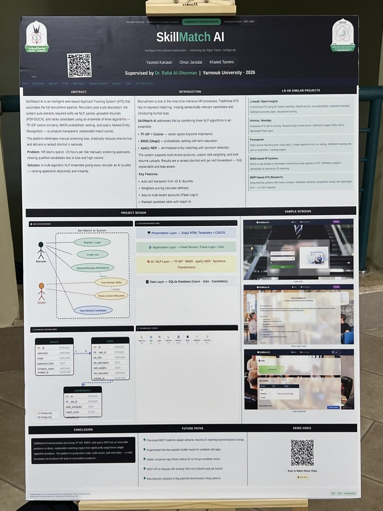
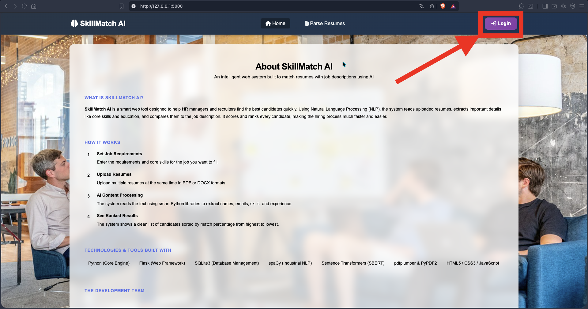
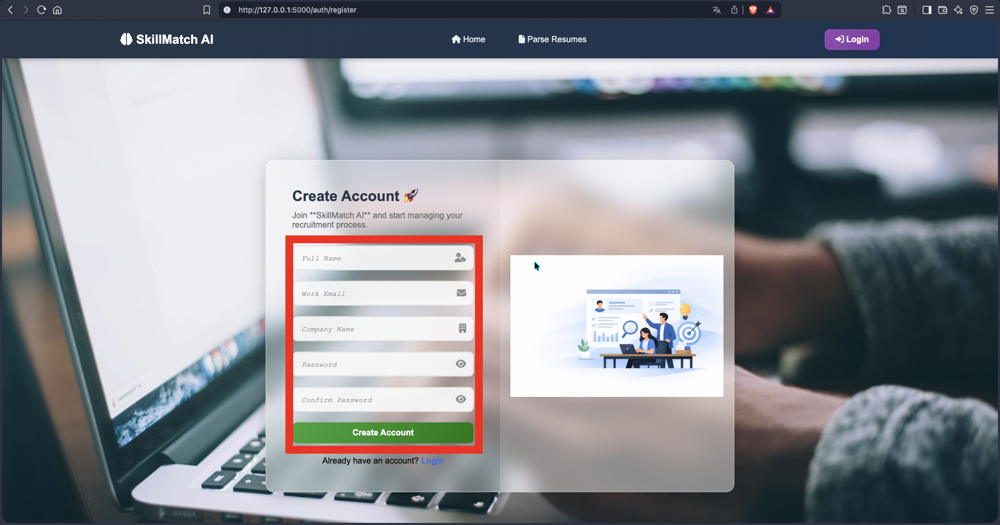
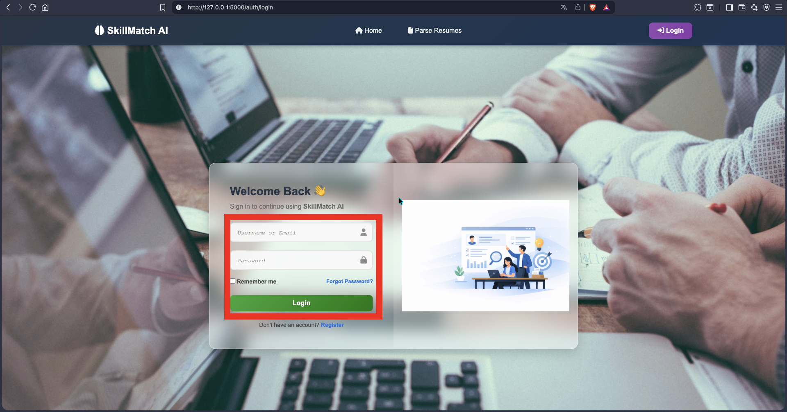
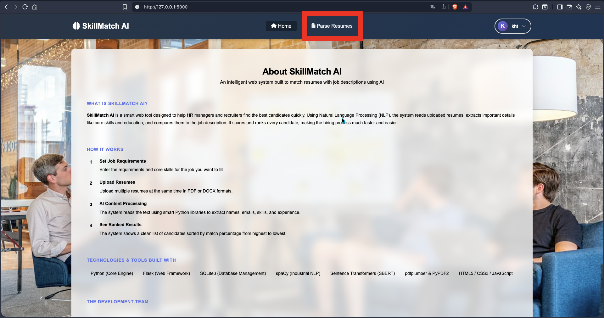
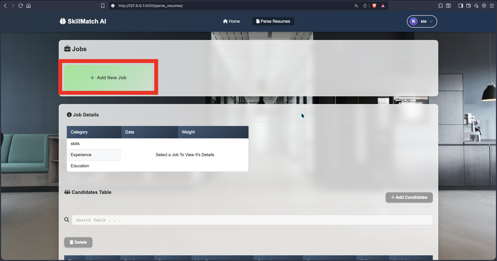
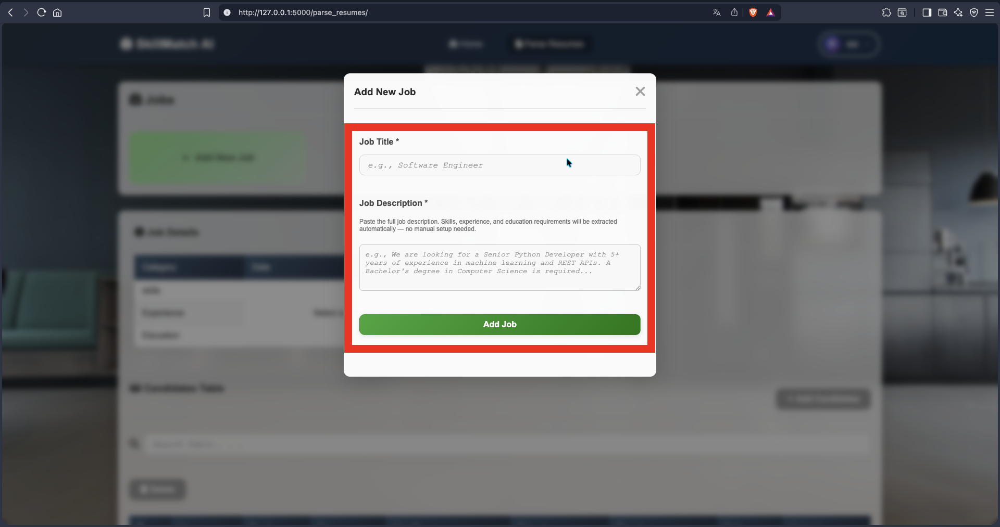
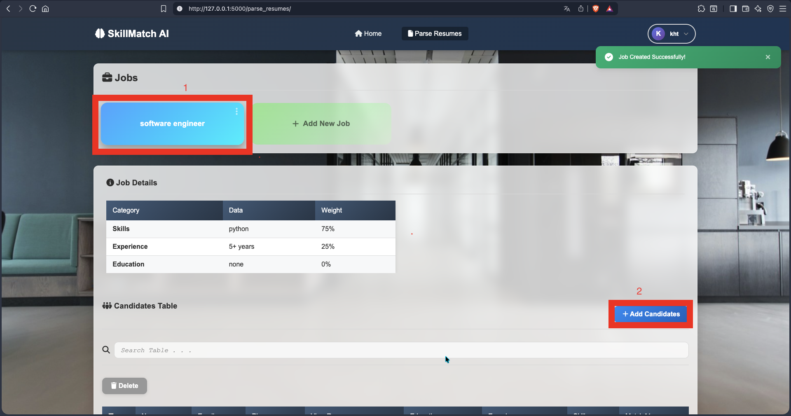
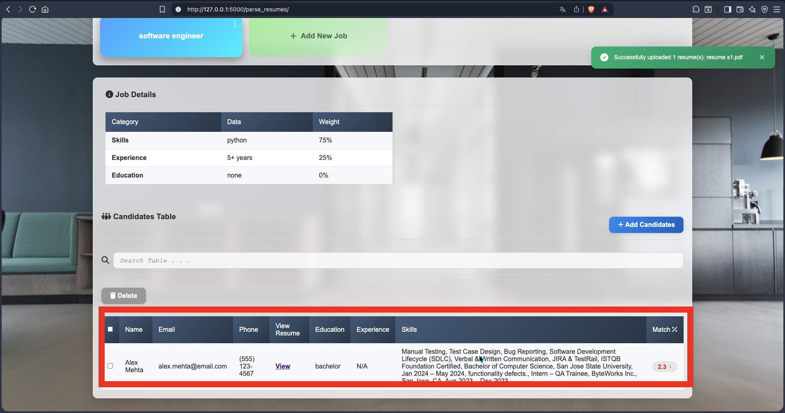
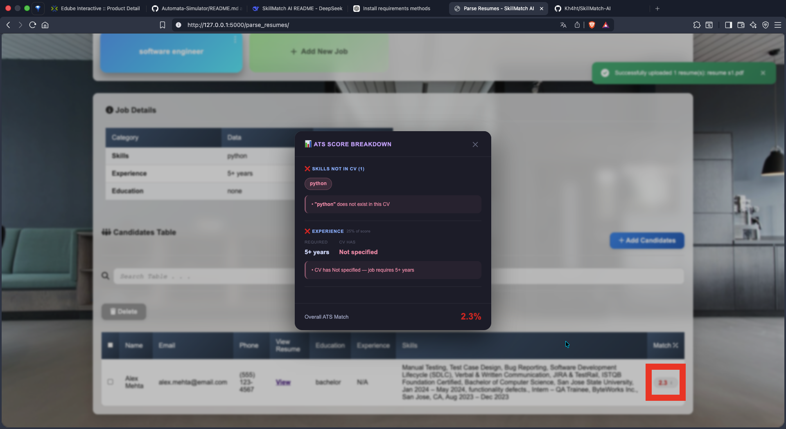

# SkillMatch AI

**An Intelligent ATS (Applicant Tracking System) for Resume Parsing and Candidate Scoring**

SkillMatch AI is a Flask-based web application that revolutionizes the recruitment process by using Natural Language Processing (NLP) to parse resumes, extract key information, and match candidates against job descriptions with intelligent scoring. This project was developed as a Senior Capstone Project (CS 499B) by a team of Computer Science students.



---

## 📋 Table of Contents

- [Project Description](#-project-description)
- [Features](#-features)
- [Technologies Used](#-technologies-used)
- [Installation](#-installation)
- [Usage & Screenshots](#-usage)
- [Future Improvements](#-future-improvements)
- [Author](#-author)
- [License](#-license)
- [Contact](#-contact)

---

## 📖 Project Description

SkillMatch AI is a smart recruitment tool designed to help HR managers and recruiters find the best candidates efficiently. The system leverages advanced NLP techniques to:

- **Extract** structured information from uploaded resumes (PDF/DOCX)
- **Analyze** job descriptions to automatically identify required skills, experience, and education
- **Score** candidates using a sophisticated ATS matching engine
- **Rank** candidates by match percentage for quick decision-making

The system eliminates manual resume screening by automating the extraction and comparison process, saving recruiters hours of work.

---

## ✨ Features

### 🔐 Authentication & User Management
- Secure user registration and login with password hashing
- Session management with Flask-Login
- Profile management (update info, change password, delete account)
- "Remember me" functionality

### 📊 Job Management
- Create, edit, and delete job postings
- Auto-extract skills, experience requirements, and education levels from job descriptions
- Visualize job requirements with weight percentages

### 📄 Resume Parsing
- Upload multiple resumes simultaneously (PDF/DOCX)
- Extract candidate information:
  - Full name
  - Email address
  - Phone number
  - Education level
  - Years of experience
  - Skills (from CV's own skills section)
- Secure file storage with unique timestamped filenames

### 🎯 ATS Scoring Engine
- **Skill matching** using token-based and lemma-based matching
- **Experience scoring** with minimum years requirement
- **Education scoring** with level hierarchy (PhD > Master > Bachelor > Diploma)
- **Text similarity** via:
  - TF-IDF cosine similarity
  - BM25 ranking
  - SBERT (Sentence-BERT) semantic similarity (optional)
- Smart weight allocation based on job description importance signals
- "Gap-fill" model: text similarity can only improve a score, never reduce it

### 💻 User Interface
- Modern glass-morphism design with blur effects
- Dark mode support (persisted via localStorage)
- Responsive layout for all screen sizes
- Interactive score breakdown with skill-level detail
- Sortable candidate tables (by experience or match score)

---

## 🛠 Technologies Used

### Backend
| Technology | Purpose |
|------------|---------|
| **Python 3.9+** | Core programming language |
| **Flask** | Web framework (application factory pattern) |
| **Flask-Login** | User session management |
| **SQLite3** | Database management |
| **Werkzeug** | Password hashing & secure file handling |

### NLP & AI
| Technology | Purpose |
|------------|---------|
| **spaCy** | Industrial-strength NLP (POS tagging, lemmatization) |
| **Sentence Transformers (SBERT)** | Semantic text similarity |
| **pdfplumber** | PDF text extraction with layout preservation |
| **python-docx** | DOCX file parsing |

### Frontend
| Technology | Purpose |
|------------|---------|
| **HTML5** | Structure |
| **CSS3** | Styling (glass-morphism, dark mode) |
| **Vanilla JavaScript** | Interactivity (tables, dropdowns, score modals) |
| **Font Awesome** | Icons |

### Development Tools
- `python-dotenv` - Environment variable management
- `venv` - Virtual environment

---

## 🚀 Installation

### Prerequisites
- Python 3.9 or higher
- pip (Python package manager)
- Git

### Step 1: Clone the Repository

```bash
git clone https://github.com/yourusername/skillmatch-ai.git
cd skillmatch-ai
```

### Step 2: Create and Activate Virtual Environment

```bash
# On Windows
py -3.11 -m venv .venv311
.venv311\Scripts\Activate.ps1

# On macOS/Linux
python3.11 -m venv .venv311
source .venv311/bin/activate
```

### Step 3: Install Dependencies

```bash
# On Windows
python -m pip install -r requirements.txt

or

py -m pip install -r requirements.txt

# On macOS/Linux
pip install -r requirements.txt
```

### Step 5: Run the Application
```bash
python run.py
```
The application will be available at http://127.0.0.1:5000

---

## 🎮 Usage

### 1. User Registration
Navigate to /register to create an account



Fill in username, email, password, and company name

Passwords must be at least 8 characters



### 2. Login
Go to /login and enter your credentials

Check "Remember me" for persistent sessions

You'll be redirected to the home page



### 3. Add a Job
Click Parse Resumes button



Click the "Add New Job" card



Enter the job title and a detailed job description



The system will auto-extract:

Required skills (with importance weights)

Minimum experience (years)

Minimum education level

Click "Add Job" to save

### 4. Upload Resumes
Select a job card to activate it

Click the "Add Candidates" button

Select one or more PDF/DOCX files



The system will:

Extract text from each resume

Parse name, email, phone, education, experience, and skills

Calculate a match score against the job requirements

Display all candidates in a sortable table



### 5. View Candidate Scores
Click on any candidate's score badge

A detailed breakdown panel appears showing:



✅ Matched skills (green)

❌ Missing skills (red) with explanations

Experience comparison (CV years vs required)

Education comparison (CV level vs required)

Overall match percentage

### 6. Manage Data
Edit Job: Use the three-dot menu on any job card

Delete Job: Remove a job and all associated candidates

Delete Candidates: Select candidates via checkboxes and click "Delete"

View Resume: Click "View" in the table to open the original resume

---

## 🔮 Future Improvements

| Area | Enhancement |
|------|------------|
| Scalability | Migrate from SQLite to PostgreSQL for production |
| File Storage | Use cloud storage (AWS S3, Google Cloud) for resume files |
| Batch Processing | Add background task queues (Celery) for large resume batches |
| Email Integration | Send match reports and notifications via email |
| API Development | Build a RESTful API for third-party integrations |
| Advanced Analytics | Visualize recruitment metrics (time-to-hire, skill gaps) |
| Multi-language Support | Add Arabic language support for the UI |
| Export Functionality | Export candidate data to CSV/Excel |
| Interview Scheduling | Integrate calendar for interview scheduling |
| Feedback Loop | Allow recruiters to give feedback on scoring accuracy |
| Enhanced NLP | Use fine-tuned BERT models for domain-specific skill extraction |
| Automated Testing | Add unit and integration tests |

## 👨‍💻 Author
This project was developed by the following Computer Science students as part of their Senior Capstone Project (CS 499B):

| Name | Student ID |
|---|----|
| Khaled Hassan Al-Tamimi | 2022901028 |

**Course:** CS 499B — Senior Capstone Project<br>
**Institution:** Yarmouk University<br>
**Academic Year:** 2025 - 2026

## 📜 License
This project is licensed under the MIT License. You are free to use, modify, and distribute this software for personal or commercial purposes.

```text
MIT License

Copyright (c) 2026 SkillMatch AI Team

Permission is hereby granted, free of charge, to any person obtaining a copy
of this software and associated documentation files (the "Software"), to deal
in the Software without restriction, including without limitation the rights
to use, copy, modify, merge, publish, distribute, sublicense, and/or sell
copies of the Software, and to permit persons to whom the Software is
furnished to do so, subject to the following conditions:

The above copyright notice and this permission notice shall be included in all
copies or substantial portions of the Software.

THE SOFTWARE IS PROVIDED "AS IS", WITHOUT WARRANTY OF ANY KIND, EXPRESS OR
IMPLIED, INCLUDING BUT NOT LIMITED TO THE WARRANTIES OF MERCHANTABILITY,
FITNESS FOR A PARTICULAR PURPOSE AND NONINFRINGEMENT. IN NO EVENT SHALL THE
AUTHORS OR COPYRIGHT HOLDERS BE LIABLE FOR ANY CLAIM, DAMAGES OR OTHER
LIABILITY, WHETHER IN AN ACTION OF CONTRACT, TORT OR OTHERWISE, ARISING FROM,
OUT OF OR IN CONNECTION WITH THE SOFTWARE OR THE USE OR OTHER DEALINGS IN THE
SOFTWARE.
```

## 📞 Contact
For questions, suggestions, or collaboration opportunities, please reach out via:

Email: [khaled.h.altamimi@gmail.com]

GitHub: [[github.com/Kh4ht](https://github.com/Kh4ht)]

<br><br>

***⭐ If you find this project useful, please consider giving it a star on GitHub! ⭐***
